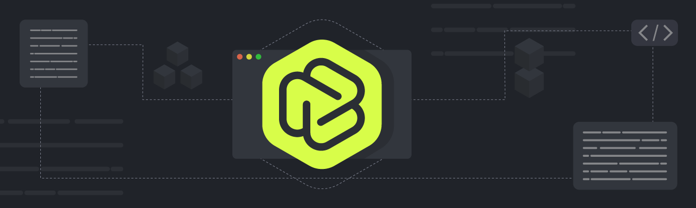

# Runtime Environment



## Features

The runtime is built on WebAssembly (Wasm) technology and therefore has the following features:

- Speed: It is built with an optimizing code generator to generate high-quality machine code quickly. The runtime is also optimized for efficient instantiation, low-overhead transitions between the embedder and Wasm, and scalability of concurrent instances.

- Compatibility: It supports running standard bytecode programs compiled from various programming languages such as C/C++, Rust, Swift, AssemblyScript, or Kotlin. It also supports mixing these languages (e.g. using Rust to implement a JavaScript API).

- Customizability: The runtime provides a configurable file to offer various options such as additional restrictions on WebAssembly beyond its basic guarantees, including CPU and memory consumption.


## Building the Project
1. Install Rust by visiting the website 'https://rustup.rs/'

2. Run the following command to build the project:
```
$ cargo build
```

## Supported Languages

Blockless supports a variety of programming languages including:

- [Go] - Tiny Go support.
- [Rust] - Blockless crate.
- [Typescript] - AssemblyScript Support.

[Go]: https://github.com/txlabs/blockless-sdk-golang
[Rust]: https://github.com/txlabs/blockless-sdk-rust
[Typescript]: https://github.com/txlabs/blockless-sdk-assemblyscript


## The example of configure file 

```json
{
    "fs_root_path": "/Users/join/Downloads", 
    "drivers_root_path": "/Users/join/Downloads", 
    "runtime_logger": "runtime.log", 
    "limited_fuel": 200000000,
    "limited_memory": 30,
    "entry": "main",
    "modules": [
        {
            "file": "/Users/join/Downloads/test1.wasm",
            "name": "linking2",
            "type": "module",
            "md5": "d41d8cd98f00b204e9800998ecf8427e"
        }
    ],
    "permissions": [
        "http://httpbin.org/anything",
        "file://a.go"
    ]
}


```

- `fs_root_path`: The root file system path of the app. When the app is opened, it will use this file system as its "/".

- `limited_fuel`: The limit of instructions the app can execute. In the example, the limit is 200000000. If the app exceeds the limit, it will be interrupted and the following message will be displayed:

```log
[2022-06-07T22:12:47Z ERROR blockless] All fuel is consumed, the app exited, fuel consumed 2013, Max Fuel is 2000.
```

- `limited_memory`: The maximum size of memory that the app can use. In the example, the maximum is 20 pages, where each page is 64k. So, the app can only use 20 * 64k of physical memory.

- `entry`: The entry is the function name. Please refer to the app example for more information.

- `permissions`: a list of resources that the app is allowed to access. If the app tries to access a resource that is not in this list, it will receive a "Permission Deny" error. If the app panics, the log will show the following message:

- `modules`: is the app wasm files. the wasm files have 2 types defined by `type` node, `module` and `entry`. `module` is lib in the app, `entry` is the entry wasm, normally the entry wasm contain the entry function.
    - `type`: he wasm files have 2 types defined by `type` node.
    - `file`: the wasm file.
    - `name`: name is used for define the linker name, the app can be use the name for the caller.
    - `md5`: the checksum of the file.

```log
panic: Permission deny
[2022-06-09T02:12:39Z ERROR blockless] Fuel 137607:200000000. wasm trap: wasm `unreachable` instruction executed
```

- `runtime_logger`: Specifies the path to the log file for the runtime environment. In the example above, all log output will be written to the file /path/to/log/file.log.

- `drivers_root_path`: Specifies the root path for the drivers used by the runtime environment. In the example above, the drivers will be stored in the directory /path/to/drivers.

for the file permission the url is start with "file://", if you use "file:///", should not work.

## Using the runtime from the command line

The runtime requires an input from stdin and also accepts environment variables passed as a list separated by ; through the BLS_LIST_VARS variable. Here's an example of how to run the app:

```bash
$ "echo "FOO" | env THIS_IS_MY_VAR=FOO BLS_LIST_VARS=THIS_IS_MY_VAR ~/.bls/runtime/blockless-cli ./build/manifest.json"
```

